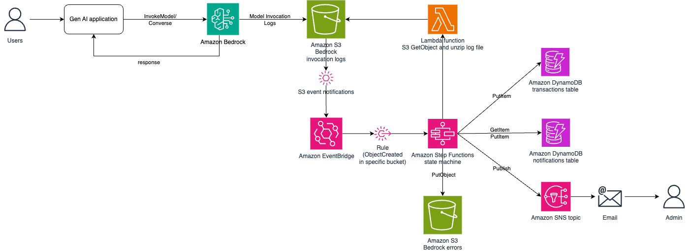
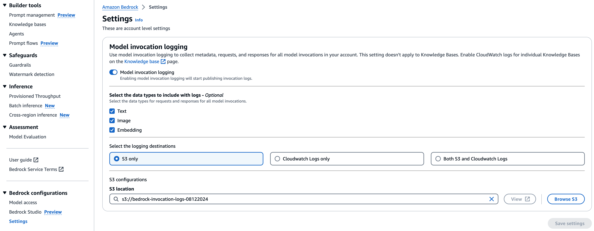
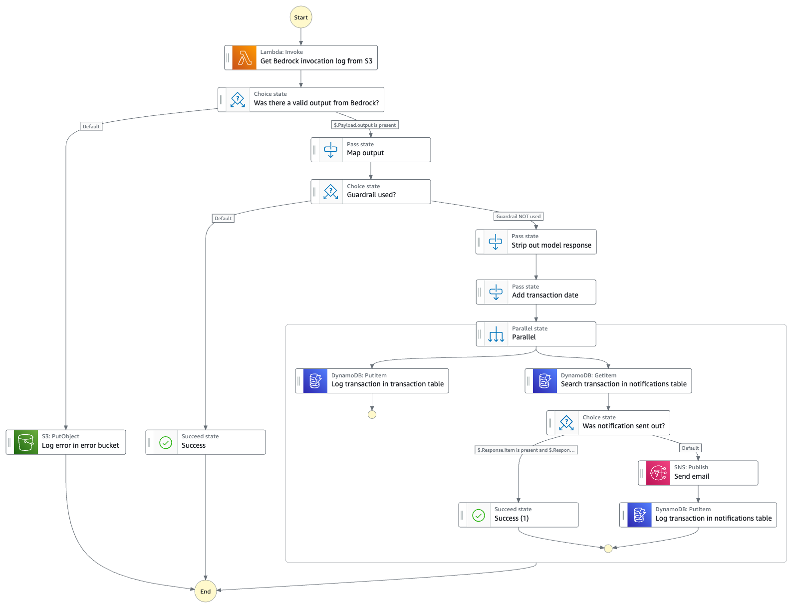

# Detect Guardrails not used on Amazon Bedrock inference calls
As a best practice, Bedrock inference API calls like InvokeModel, InvokeModelWithResponseStream, Converse and ConverseStream APIs should include Guardrails for Amazon Bedrock in the request. This ensures that both the prompt to the foundation model and the response from the model are inspected by a guardrail to redact any potentially harmful content or personally identifiable information (PII) from being accidentally exposed.

This sample shows a serverless solution that employs a Step Functions State Machine that is triggered when a Bedrock inference API call is made, provided Bedrock model invocation logs to S3 are enabled. The information from this log is then used to determine whether guardrails were used and if it intervened when making the Bedrock inference API call. If not used, an alert is generated to email subscribers on an Amazon SNS topic and details of the transaction, including the IAM identity making the call, is logged in Amazon DynamoDB. The solution protects email recipients from getting slammed with emails when a lot of API calls are being made, by ensuring that calls from the same identity on the same day is only reported once.

The project contains a CloudFormation template (`bedrock-guardrails-detection-template.yaml`) that deploys the workload on your AWS account and a zipped archive with Lambda code that will be used to deploy a Lambda function that gets model invocation logs from an S3 bucket to which Amazon Bedrock writes the log files.

Important: this application uses various AWS services and there are costs associated with these services after the Free Tier usage - please see the [AWS Pricing page](https://aws.amazon.com/pricing/) for details. You are responsible for any AWS costs incurred. No warranty is implied in this example.

## Requirements

* [Create an AWS account](https://portal.aws.amazon.com/gp/aws/developer/registration/index.html) if you do not already have one and log in. The IAM user that you use must have sufficient permissions to make necessary AWS service calls and manage AWS resources.
* [AWS CLI](https://docs.aws.amazon.com/cli/latest/userguide/install-cliv2.html) installed and configured
* [Git Installed](https://git-scm.com/book/en/v2/Getting-Started-Installing-Git)

## Deployment Instructions



This project includes the following files and folders.

* **docs** - Directory containing supporting documents/diagrams
* **lambda-code** - Directory containing a Lambda function code archive that provides the Lambda handler code for the function that gets log files from an S3 bucket and unzips them
* **bedrock-guardrails-detection-template.yaml** - CloudFormation template file that deploys the solution

**Steps to deploy:**

1. Create an Amazon S3 bucket to contain the model invocation logs from Amazon Bedrock. Under bucket Properties, turn Amazon EventBridge notification to **On**. This enables Amazon S3 to send an event notification to the Amazon EventBridge default event bus, whenever a log file is created in the bucket by Amazon Bedrock.
2. Go to the Amazon Bedrock console and enable **Model invocation logging** under Bedrock Configuration > Settings, from the left navigation pane. Specify the bucket created in step 1 above under S3 location.

3. Create two more Amazon S3 buckets - one that will be used by the Step Functions state machine to store Bedrock model invocation errors detected from the log, and the other that will store the Lambda function code for this solution. Inside the latter bucket, create a Folder called `code` (or any other preferred name) and upload the ZIP archive under the `lambda-code` folder of this repository, into that S3 folder. Note the names for these two Amazon S3 buckets and the S3 object key for the Lambda ZIP file. These will need to be specified as input parameters to the CloudFormation template.
4. From the CloudFormation console or using CLI, create a stack using the template provided in this repository called `bedrock-guardrails-detection-template.yaml`. For inputs specify the BedrockLogsBucket (from Step 1), BedrockLogsErrorBucket (from Step 3), LambdaFunctionCodeBucket (from Step 3), LambdaFunctionCodeBucketKey (S3 object key for the ZIP file uploaded in Step 3 - for instance `code/get-bedrock-logs-from-s3.py.zip`), NotificationEmailAddress (email address to subscribe to the SNS topic), and . The stack may take few minutes to complete deployment.
5. Once deployment is complete, access the email inbox for the email address specified during the CloudFormation stack deployment and confirm the email subscription the SNS topic. The email should be titled - `AWS Notification - Subscription Confirmation`. Click on the `Confirm subscription` link inside the email to complete the subscription process. The email account is now ready to receive notifications from this solution.

## AWS Step Functions State Machines created by this solution


## How this works:

The first step in the state machine is to get the logs from the S3 bucket indicated in the event object. If the log file shows that the Bedrock API invocation was successful, the state machine collects the output section of the log entry that is required for further evaluation. The next step is to check if Guardrails for Amazon Bedrock was used. If so, the flow completes successfully and no further action is required. If guardrail was not used, collects a few pieces of information from the log file necessary to log the transaction and also adds the transaction date. The transaction is then logged into the transactions table in DynamoDB. Parallely, the flow checks if a notification for this identity has already been sent for the current date by looking up the notifications table in DynamoDB. If a notification hasn't been sent already, an email is sent out to a monitored address via an SNS topic and the notifications table in DynamoDB is updated ro reflect that it has been sent. This is a safety net to ensure the same identity is not reported twice in the same date - to prevent swamping the email recipient in case the same identity is making several calls on the same date.

## Cleanup
 
1. Delete the stack
    ```bash
    aws cloudformation delete-stack --stack-name STACK_NAME
    ```
2. Confirm the stack has been deleted
    ```bash
    aws cloudformation list-stacks --query "StackSummaries[?contains(StackName,'STACK_NAME')].StackStatus"
    ```
3. Empty contents of the S3 buckets created manually as a pre-requisite to deploying the CloudFormation stack, and delete the buckets.
4. Turn off model invocation logging from under Settings in Amazon Bedrock console, if it's not desired any longer.

## Additional considerations

Amazon Bedrock model invocation logging captures requests and responses from model invocations and stores the logs in the destination of your choosing - in this sample it is in an Amazon S3 bucket that you create. 

1. To protect information you may choose to use to encrypt the contents using SSE-KMS on the bucket and specify a customer managed encyption key. More details are [here](https://docs.aws.amazon.com/bedrock/latest/userguide/model-invocation-logging.html#setup-s3-destination).
2. Do a daily cleanup of the model invocation logs bucket using an S3 lifecycle configuration rule as mentioned in this [post](https://repost.aws/knowledge-center/s3-empty-bucket-lifecycle-rule).


## Security

See [CONTRIBUTING](CONTRIBUTING.md#security-issue-notifications) for more information.

## License

This library is licensed under the MIT-0 License. See the LICENSE file.
